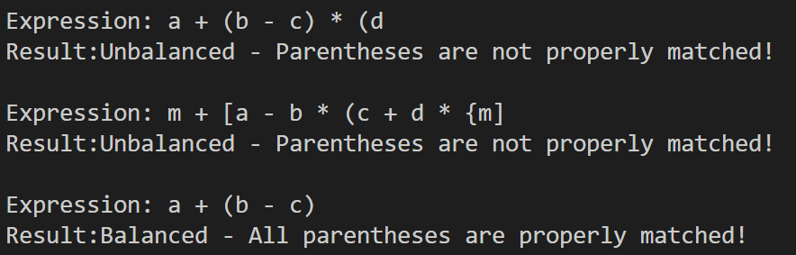

# Program 1: Balanced Parentheses Checker

## Overview
This program checks whether a mathematical expression has balanced parentheses, brackets, and braces using a stack data structure.

## Data Structures

### Stack Structure
typedef struct {
    char data[MAX_SIZE]; 
    int top;              
} Stack;
**Purpose**: The stack is used to keep track of opening brackets. When we encounter a closing bracket, we can check if it matches the most recent opening bracket by popping from the stack.

## Functions Implemented

### 1. `void initStack(Stack *s)`
- **Purpose**: Initializes the stack by setting top to -1
- **Parameters**: Pointer to Stack structure
- **Returns**: Nothing (void)

### 2. `bool isEmpty(Stack *s)`
- **Purpose**: Checks if the stack is empty
- **Returns**: true if stack is empty (top == -1), false otherwise

### 3. `bool isFull(Stack *s)`
- **Purpose**: Checks if the stack has reached maximum capacity
- **Returns**: true if stack is full (top == MAX_SIZE - 1), false otherwise

### 4. `void push(Stack *s, char ch)`
- **Purpose**: Adds a character to the top of the stack
- **Parameters**: Stack pointer and character to push
- **Note**: Includes overflow checking with error message

### 5. `char pop(Stack *s)`
- **Purpose**: Removes and returns the top character from the stack
- **Returns**: The popped character, or -1 if stack is empty
- **Note**: Includes underflow checking with error message

### 6. `char peek(Stack *s)`
- **Purpose**: Returns the top character without removing it
- **Returns**: Top character or -1 if empty
- **Note**: Useful for examining the stack without modifying it

### 7. `bool isOpeningBracket(char ch)`
- **Purpose**: Checks if a character is '(', '[', or '{'
- **Returns**: true if character is an opening bracket

### 8. `bool isClosingBracket(char ch)`
- **Purpose**: Checks if a character is ')', ']', or '}'
- **Returns**: true if character is a closing bracket

### 9. `bool isMatchingPair(char opening, char closing)`
- **Purpose**: Verifies if two brackets form a valid pair
- **Examples**: '(' matches ')', '[' matches ']', '{' matches '}'
- **Returns**: true if brackets match

### 10. `bool areParenthesesBalanced(const char *expression)`
- **Purpose**: Main algorithm to check if expression has balanced parentheses
- **Algorithm**:
  1. Initialize an empty stack
  2. Scan the expression character by character
  3. If opening bracket: push onto stack
  4. If closing bracket: 
     - Check if stack is empty (indicates unbalanced - closing without opening)
     - Pop from stack and verify it matches the closing bracket
  5. After scanning, stack should be empty (all brackets properly closed)
- **Returns**: true if balanced, false otherwise

### 11. `void checkAndDisplay(const char *expression)`
- **Purpose**: User-friendly wrapper that displays the result
- **Output**: Shows expression and whether it's balanced or not
- **Format**: 
  - Expression: [expression string]
  - Result: Balanced/Unbalanced with descriptive message

## Main Method Organization

The `main()` function is structured as follows:

1. **Test Case Definitions**: Creates three test expressions:
   - `test1: "a + (b - c) * (d"` → Unbalanced (missing closing parenthesis)
   - `test2: "m + [a - b * (c + d * {m]"` → Unbalanced (mismatched brackets)
   - `test3: "a + (b - c)"` → Balanced (all brackets properly matched)
2. **Test Execution**: Calls `checkAndDisplay()` for each test case
3. **Clean Exit**: Returns 0 on successful completion

## How the Algorithm Works

**Example**: For expression `"a + (b - c)"`

1. Character 'a': Not a bracket, skip
2. Character '+': Not a bracket, skip
3. Character '(': Opening bracket, push to stack → Stack: ['(']
4. Character 'b': Not a bracket, skip
5. Character '-': Not a bracket, skip
6. Character 'c': Not a bracket, skip
7. Character ')': Closing bracket, pop '(' from stack and verify match → Stack: []
8. End of expression: Stack is empty → **Balanced**

**Example**: For expression `"a + (b - c) * (d"`

1. Processes characters until first '(' → push to stack
2. Processes until ')' → pop and match
3. Processes until second '(' → push to stack
4. End of expression: Stack still contains '(' → **Unbalanced**

## Sample Output

