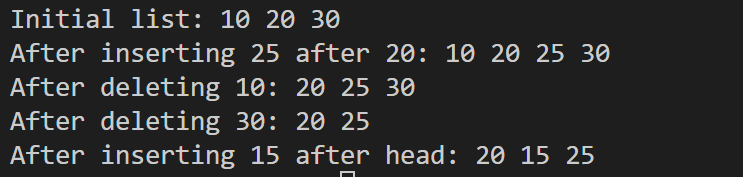

# Program 4: Doubly Linked List Implementation

## Overview
This program implements a simple doubly linked list with only two operations: inserting after a given node and deleting a node. It demonstrates how nodes can be inserted or removed while maintaining both forward and backward links.

## Data Structures

### Node Structure
typedef struct Node {
    int data;           // Data stored in the node
    struct Node *prev;  // Pointer to previous node
    struct Node *next;  // Pointer to next node
} Node;

## Functions Implemented

### Core Operations

#### 1. `void insertAfter(Node *prevNode, int newData)`
- **Purpose**: Inserts a new node after a specified node.
- **Steps**:
  1. Create new node `N`
  2. Set `N.prev = P`
  3. Set `N.next = P.next`
  4. Update `P.next = N`
  5. If `P.next` exists, set its `prev = N`

**Special Cases**:
- `prevNode` is NULL → cannot insert
- `prevNode` is last node → new node becomes last

#### 2. `void deleteNode(Node **head, int data)`
- **Purpose**: Deletes a node containing a specified data value.
- **Steps**:
  1. Search for node `D` with the given data
  2. If `D.prev` exists: `D.prev->next = D.next`
  3. If `D.next` exists: `D.next->prev = D.prev`
  4. If `D` is head: update `head = D.next`
  5. Free `D`

**Special Cases**:
- Delete head → head pointer updated
- Delete last node → previous node's next updated
- Node not found → do nothing

### Display Function

#### `void printList(Node *head)`
- Prints list from head to tail
- Format: `10 20 30`

## Main Function Demonstration

The `main()` function is structured as follows:

- **Predefined Nodes**: Creates 3 initial nodes manually (10, 20, 30) and links them.
- It contains the following operations:
  1. Insert 25 after node with data 20
  2. Delete node with data 10 (head)
  3. Delete node with data 30 (tail)
  4. Insert 15 after the current head
- **Display**: Prints the list after each operation to show the current state.

## Sample Output
