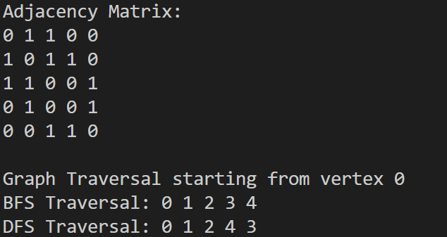

# Program 5: Graph Traversal Algorithms
## Description
This program demonstrates graph traversal techniques using an adjacency matrix representation. It implements both Breadth-First Search (BFS) and Depth-First Search (DFS) algorithms on an undirected graph structure.

## Data Structure
The graph uses an adjacency matrix for representation:
- Matrix element `graph[i][j] = 1` represents an edge connecting vertices `i` and `j`
- Matrix element `graph[i][j] = 0` indicates no direct connection between vertices


## Algorithm Implementations

### Breadth-First Search (BFS)
```c
void BFS(int graph[MAX][MAX], int vertices, int start);
```
**Characteristics:**
- Explores graph layer by layer from the starting vertex
- Utilizes a queue data structure (First-In-First-Out)
- Visits all neighboring vertices at current depth before proceeding to next level

### Depth-First Search (DFS)
```c
void DFS(int graph[MAX][MAX], int vertices, int v, int visited[]);
```
**Characteristics:**
- Explores graph by going as deep as possible along each branch
- Implements recursion (uses implicit call stack)
- Backtracks when no unvisited adjacent vertices remain

## Program Execution Flow
1. Define total number of vertices in the graph
2. Create and populate the adjacency matrix with edge connections
3. Print the adjacency matrix to console
4. Execute BFS traversal beginning at vertex 0
5. Execute DFS traversal beginning at vertex 0

## Example Output
