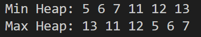

# Program 6: Min Heap and Max Heap Builder
## Description
This program constructs both min heap and max heap data structures from unsorted arrays using the heapify algorithm to organize elements efficiently.

## Array-Based Heap Structure
Heaps are implemented using array representation where for any element at index `i`:
* Left child is located at: `2*i + 1`
* Right child is located at: `2*i + 2`
* Parent node is located at: `(i-1)/2`

## Heap Properties
* **Min Heap**: Every parent node value ≤ its children values
* **Max Heap**: Every parent node value ≥ its children values

---

## Function Descriptions

### 1. `swap(int *a, int *b)`
Exchanges values of two integer variables

### 2. `minHeapify(int arr[], int n, int i)`
Ensures min heap property is satisfied at the given index position

### 3. `buildMinHeap(int arr[], int n)`
Transforms an unsorted array into a valid min heap structure

### 4. `maxHeapify(int arr[], int n, int i)`
Ensures max heap property is satisfied at the given index position

### 5. `buildMaxHeap(int arr[], int n)`
Transforms an unsorted array into a valid max heap structure

### 6. `printArray(int arr[], int n, const char *label)`
Displays array contents with a descriptive label

## Program Workflow
1. Initialize an unsorted array `data[]`
2. Duplicate array contents into separate min heap and max heap arrays
3. Invoke `buildMinHeap()` to construct the min heap
4. Invoke `buildMaxHeap()` to construct the max heap
5. Display both resulting heaps using `printArray()`

## Sample Output
