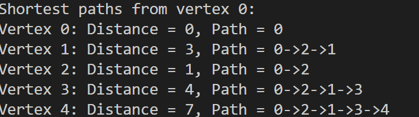

# Program 7: Dijkstra's Shortest Path Algorithm
## Description
This program implements Dijkstra's algorithm to find the shortest paths from a source vertex to all other vertices in a weighted undirected graph. It uses an adjacency matrix representation and displays both the minimum distances and the actual paths.

## Graph Representation
The weighted graph is stored using an adjacency matrix where:
- `adjMatrix[i][j]` contains the weight of the edge between vertex `i` and vertex `j`
- `adjMatrix[i][j] = INF` indicates no direct edge exists
- `adjMatrix[i][i] = 0` for all vertices (distance to self is zero)

## Algorithm Overview
Dijkstra's algorithm finds the shortest path by:
- Maintaining a set of visited vertices
- Repeatedly selecting the unvisited vertex with minimum distance
- Updating distances to adjacent vertices through relaxation
- Tracking parent vertices to reconstruct paths


## Data Structure

### WeightedGraph
```c
typedef struct {
    int numVertices;
    int adjMatrix[MAX_VERTICES][MAX_VERTICES];
} WeightedGraph;
```

## Function Descriptions

### 1. `createWeightedGraph(int vertices)`
Allocates memory and initializes a weighted graph with specified number of vertices

### 2. `addWeightedEdge(WeightedGraph *graph, int src, int dest, int weight)`
Adds an undirected weighted edge between two vertices

### 3. `findMinDistance(int dist[], bool visited[], int n)`
Identifies the unvisited vertex with the smallest tentative distance

### 4. `dijkstra(WeightedGraph *graph, int src)`
Computes shortest paths from source vertex to all reachable vertices and displays results

## Program Execution Steps
1. Create a weighted graph with 5 vertices
2. Add weighted edges to form the graph structure
3. Execute Dijkstra's algorithm from vertex 0 as source
4. Display shortest distances and complete paths to all vertices
5. Free allocated memory

## Output Format
For each vertex, the program displays:
- Vertex number
- Shortest distance from source
- Complete path from source to destination (if reachable)
- "No path" message for unreachable vertices

## Sample Output
