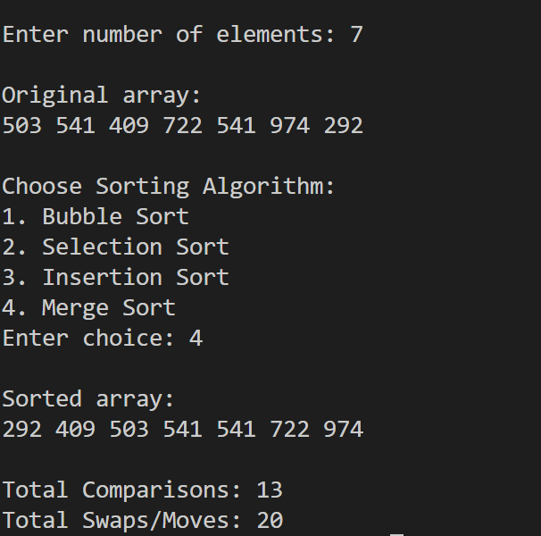

# Program 8: Sorting Algorithm Performance Analyzer
## Description
This program implements and compares four fundamental sorting algorithms: Bubble Sort, Selection Sort, Insertion Sort, and Merge Sort. It generates random arrays and tracks performance metrics including comparisons and swaps/moves for each algorithm.

## Sorting Algorithms Implemented

### 1. Bubble Sort
- Repeatedly compares adjacent elements and swaps if out of order
- Time Complexity: O(n²)
- Space Complexity: O(1)

### 2. Selection Sort
- Finds minimum element and places it at the beginning in each iteration
- Time Complexity: O(n²)
- Space Complexity: O(1)

### 3. Insertion Sort
- Builds sorted array one element at a time by inserting elements in correct position
- Time Complexity: O(n²)
- Space Complexity: O(1)

### 4. Merge Sort
- Divides array into halves, recursively sorts them, and merges sorted halves
- Time Complexity: O(n log n)
- Space Complexity: O(n)


## Global Variables
```c
long long comparisons  
long long swaps        
```

## Function Descriptions

### 1. `resetCounters()`
Resets comparison and swap counters to zero before sorting begins

### 2. `printArray(int arr[], int n)`
Displays all elements of the array

### 3. `bubbleSort(int arr[], int n)`
Implements bubble sort with performance tracking

### 4. `selectionSort(int arr[], int n)`
Implements selection sort with performance tracking

### 5. `insertionSort(int arr[], int n)`
Implements insertion sort with performance tracking

### 6. `merge(int arr[], int l, int m, int r)`
Merges two sorted subarrays into a single sorted array

### 7. `mergeSort(int arr[], int l, int r)`
Implements merge sort recursively with performance tracking

## Program Flow
1. Prompt user to enter the number of elements
2. Generate random array with values between 1 and 1000
3. Display the original unsorted array
4. Present menu of available sorting algorithms
5. Accept user's algorithm choice
6. Reset performance counters
7. Execute selected sorting algorithm
8. Display sorted array
9. Show performance statistics (comparisons and swaps/moves)

## Performance Metrics
The program tracks and displays:
- **Total Comparisons**: Number of element comparison operations
- **Total Swaps/Moves**: Number of element movement operations

## Sample Output

